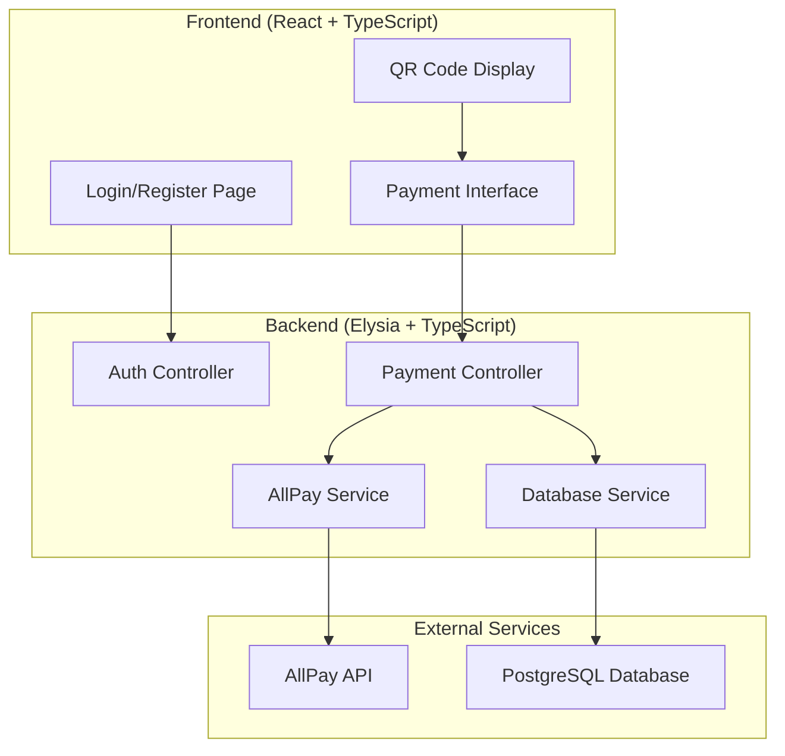

# Design Document

## Overview

SB0 Pay is a TypeScript-based Point of Sale system built with Bun runtime, featuring a React frontend and Elysia backend. The system integrates with AllPay's payment API to generate payment links and displays QR codes for customer payments. The architecture prioritizes speed, simplicity, and mobile-first design with minimal clicks required for payment processing.

## Architecture

### System Architecture



### Technology Stack

- **Runtime**: Bun (TypeScript execution and package management)
- **Backend**: Elysia with TypeScript (optimized for Bun)
- **Frontend**: React with TypeScript, Vite for bundling
- **Database**: PostgreSQL with connection pooling
- **Authentication**: JWT tokens with secure HTTP-only cookies
- **QR Code Generation**: qrcode library
- **HTTP Client**: fetch API for AllPay integration
- **Styling**: Tailwind CSS for mobile-first, responsive design

## Components and Interfaces

### Frontend Components

#### 1. Authentication Components
- **LoginForm**: Email/password login with validation
- **RegisterForm**: Multi-step registration collecting shop and AllPay details
- **AuthGuard**: Route protection component

#### 2. Payment Components
- **PaymentForm**: Amount input with numeric validation and currency formatting
- **QRCodeDisplay**: Large QR code with payment details and new payment button
- **PaymentStatus**: Real-time payment status updates

#### 3. Layout Components
- **AppLayout**: Mobile-first application shell with touch-optimized logout functionality
- **LoadingSpinner**: Consistent loading states optimized for mobile screens
- **ErrorBoundary**: Global error handling with mobile-friendly error messages

### Backend Services (Elysia)

#### 1. Authentication Service
```typescript
interface AuthService {
  register(userData: RegisterData): Promise<{ user: User; token: string }>;
  login(email: string, password: string): Promise<{ user: User; token: string }>;
  validateToken(token: string): Promise<User>;
}

// Elysia route structure
app.group('/auth', (app) =>
  app
    .post('/register', registerHandler)
    .post('/login', loginHandler)
    .get('/me', authGuard, getMeHandler)
)
```

#### 2. AllPay Service
```typescript
interface AllPayService {
  createPayment(amount: number, merchantConfig: MerchantConfig): Promise<PaymentResponse>;
  validateWebhook(payload: any, signature: string): boolean;
}

interface PaymentResponse {
  paymentUrl: string;
  transactionId: string;
  status: 'pending' | 'completed' | 'failed';
}
```

#### 3. Database Service
```typescript
interface DatabaseService {
  createUser(userData: CreateUserData): Promise<User>;
  getUserByEmail(email: string): Promise<User | null>;
  createTransaction(transactionData: CreateTransactionData): Promise<Transaction>;
  updateTransactionStatus(id: string, status: TransactionStatus): Promise<void>;
}
```

## Data Models

### User Model
```typescript
interface User {
  id: string;
  email: string;
  passwordHash: string;
  shopName: string;
  ownerName: string;
  merchantConfig: MerchantConfig;
  createdAt: Date;
  updatedAt: Date;
}

interface MerchantConfig {
  merchantId: string;
  terminalId: string;
  successUrl: string;
  failureUrl: string;
  notificationUrl: string;
  currency: string;
  language: string;
}
```

### Transaction Model
```typescript
interface Transaction {
  id: string;
  userId: string;
  amount: number;
  currency: string;
  paymentUrl: string;
  allpayTransactionId: string;
  status: 'pending' | 'completed' | 'failed' | 'cancelled';
  createdAt: Date;
  updatedAt: Date;
}
```

### Database Schema
```sql
-- Users table
CREATE TABLE users (
  id UUID PRIMARY KEY DEFAULT gen_random_uuid(),
  email VARCHAR(255) UNIQUE NOT NULL,
  password_hash VARCHAR(255) NOT NULL,
  shop_name VARCHAR(255) NOT NULL,
  owner_name VARCHAR(255) NOT NULL,
  merchant_config JSONB NOT NULL,
  created_at TIMESTAMP DEFAULT NOW(),
  updated_at TIMESTAMP DEFAULT NOW()
);

-- Transactions table
CREATE TABLE transactions (
  id UUID PRIMARY KEY DEFAULT gen_random_uuid(),
  user_id UUID REFERENCES users(id),
  amount DECIMAL(10,2) NOT NULL,
  currency VARCHAR(3) DEFAULT 'ILS',
  payment_url TEXT NOT NULL,
  allpay_transaction_id VARCHAR(255),
  status VARCHAR(20) DEFAULT 'pending',
  created_at TIMESTAMP DEFAULT NOW(),
  updated_at TIMESTAMP DEFAULT NOW()
);

-- Indexes for performance
CREATE INDEX idx_transactions_user_id ON transactions(user_id);
CREATE INDEX idx_transactions_status ON transactions(status);
CREATE INDEX idx_transactions_created_at ON transactions(created_at);
```

## AllPay Integration

### API Configuration
- **Base URL**: https://www.allpay.co.il/api/
- **Authentication**: API key in headers
- **Login**: pp1012035
- **API Key**: E51C3EA351988CB77BCC97D2642A45AE

### Payment Flow
1. **Create Payment Request**:
   ```typescript
   const paymentRequest = {
     amount: amount * 100, // Convert to agorot
     currency: 'ILS',
     merchantId: user.merchantConfig.merchantId,
     terminalId: user.merchantConfig.terminalId,
     successUrl: user.merchantConfig.successUrl,
     failureUrl: user.merchantConfig.failureUrl,
     notificationUrl: user.merchantConfig.notificationUrl
   };
   ```

2. **Generate Payment URL**: AllPay returns a payment URL for QR code generation

3. **Webhook Handling**: Process payment status updates from AllPay

### Security Considerations
- API credentials stored as environment variables
- Webhook signature validation
- HTTPS-only communication
- Request rate limiting

## Error Handling

### Frontend Error Handling
- **Network Errors**: Retry mechanism with exponential backoff
- **Validation Errors**: Real-time form validation with clear messages
- **API Errors**: User-friendly error messages with retry options
- **Offline Handling**: Queue payments when offline, process when online

### Backend Error Handling
- **Database Errors**: Connection pooling with automatic retry
- **AllPay API Errors**: Detailed error logging with user-friendly responses
- **Authentication Errors**: Clear error messages without exposing security details
- **Validation Errors**: Comprehensive input validation with detailed feedback

### Error Response Format
```typescript
interface ErrorResponse {
  error: {
    code: string;
    message: string;
    details?: any;
  };
  timestamp: string;
  requestId: string;
}
```

## Testing Strategy

### Unit Testing
- **Backend Services**: Jest with mocked dependencies
- **Frontend Components**: React Testing Library with Jest
- **Database Operations**: In-memory PostgreSQL for testing
- **AllPay Integration**: Mock API responses for reliable testing

### Integration Testing
- **API Endpoints**: Supertest for HTTP endpoint testing
- **Database Integration**: Test database with real PostgreSQL
- **Authentication Flow**: End-to-end auth testing
- **Payment Flow**: Mock AllPay integration testing

### End-to-End Testing
- **User Registration**: Complete registration flow
- **Payment Creation**: Full payment creation and QR display
- **Error Scenarios**: Network failures, API errors, validation failures

### Performance Testing
- **Payment Creation Speed**: Target <3 seconds for payment link generation
- **Database Query Performance**: Optimized queries with proper indexing
- **Frontend Load Time**: Target <2 seconds initial load
- **Concurrent Users**: Test system under multiple simultaneous payments

### Test Coverage Goals
- Backend: >90% code coverage
- Frontend: >85% code coverage
- Critical paths: 100% coverage (auth, payment creation)

## Mobile-First Design Considerations

### UI/UX Design Principles
- **Touch-First Interface**: Large touch targets (minimum 44px), easy thumb navigation
- **Single-Hand Operation**: Critical actions accessible within thumb reach
- **Minimal Input**: Auto-focus on amount field, numeric keypad for amount entry
- **Large QR Codes**: Minimum 200x200px QR codes for easy scanning
- **High Contrast**: Ensure readability in various lighting conditions (outdoor markets, etc.)

### Mobile Optimization
- **Responsive Breakpoints**: 
  - Mobile: 320px - 768px (primary focus)
  - Tablet: 768px - 1024px (secondary)
  - Desktop: 1024px+ (minimal support)
- **Progressive Web App**: Installable PWA for native-like experience
- **Offline Capability**: Service worker for basic offline functionality
- **Fast Loading**: Target <2 seconds on 3G networks

### Mobile-Specific Features
- **Haptic Feedback**: Vibration on successful payment creation
- **Screen Wake Lock**: Keep screen active during payment process
- **Auto-Rotation Lock**: Portrait mode for consistent UX
- **Keyboard Optimization**: Numeric input with proper input modes

## Security and Performance

### Security Measures
- **Password Hashing**: bcrypt with salt rounds
- **JWT Security**: Short-lived tokens with secure HTTP-only cookies
- **Input Validation**: Comprehensive validation on both frontend and backend
- **SQL Injection Prevention**: Parameterized queries only
- **CORS Configuration**: Restricted to frontend domain
- **Rate Limiting**: Prevent API abuse

### Performance Optimizations
- **Elysia Performance**: Native Bun optimization with Elysia's high-performance routing
- **Database Connection Pooling**: Efficient database connections
- **Frontend Code Splitting**: Lazy loading for optimal mobile bundle size
- **Mobile-First Loading**: Critical CSS inlined, progressive enhancement
- **API Response Caching**: Cache static data where appropriate
- **Image Optimization**: Optimized QR code generation for mobile screens
- **Compression**: Brotli/Gzip compression for API responses